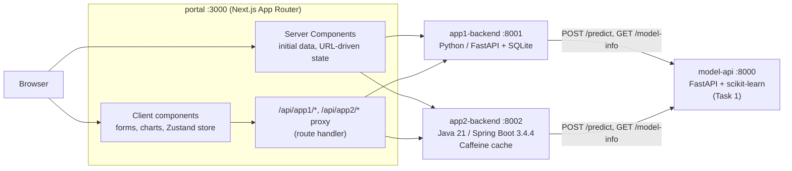
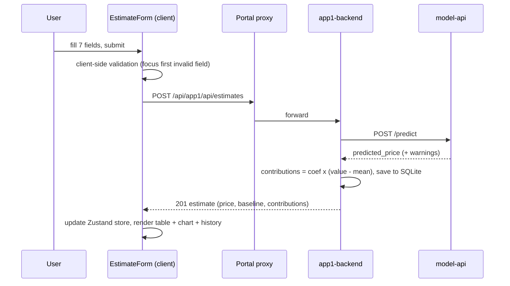
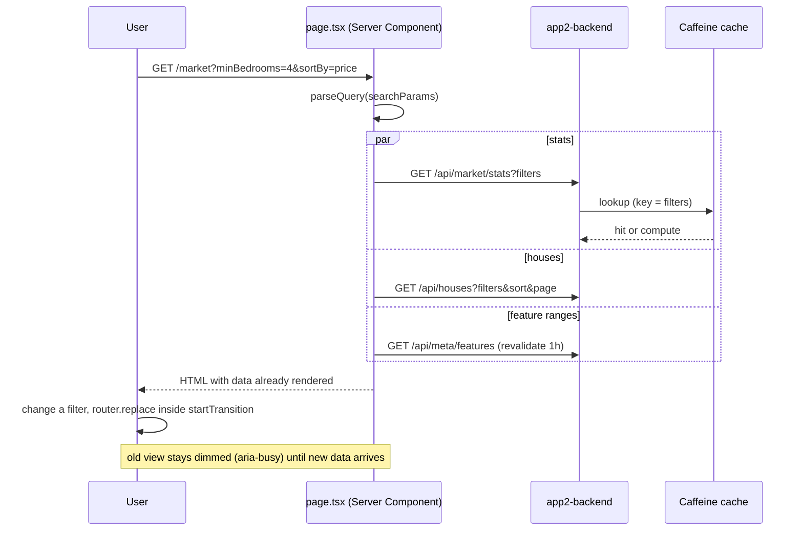

# Architecture

## System view



**One model, two consumers.** Both backends call the same model container over HTTP, so there is a single source of truth for predictions and coefficients. Each backend owns only its own domain logic.

| Service | Owns | Notable design points |
|---|---|---|
| `model-api` | Training artefact (`model.joblib`), `/predict` (single + batch), `/model-info`, `/health` | Pydantic v2 validation, per-field 422 errors, extrapolation warnings, non-root Docker image |
| `app1-backend` (Python) | Estimate history (SQLite), validation, comparison, explanation (effect of each feature vs. an average home) | `HistoryStore` class isolates all SQL (stdlib sqlite3), DB on a Docker volume, fake model in tests via `httpx.MockTransport` |
| `app2-backend` (Java) | Market statistics, filtered/sorted/paged houses, CSV export, what-if and price-curve sweeps | Records + Bean Validation, `RestClient` with timeouts, `@Cacheable` (Caffeine, 10 min TTL), `@RestControllerAdvice` error shape |
| `portal` | Both UIs, routing, shared design system | RSC for initial data, URL as state, BFF proxy, per-request Zustand store |

## Request flows

### Estimate a property (App 1)



### Market page (App 2)



### What-if

`POST /api/what-if {base, changes}` -> the backend builds the base and scenario property, **predicts both in one batch call** to the model, and returns both prices, the delta and any out-of-range warnings. The price curve (`/api/what-if/sweep`) does the same for N values of one feature.

## Frontend structure

```
portal/src
  app/            routes: /, /estimator, /market  (+ loading.tsx, error.tsx, not-found, api proxy)
  components/
    ui/           design-system primitives (Button, Card, Alert, Tabs, Field, ...)
    estimator/    form, result, history, compare
    market/       filter bar, tiles, charts, table, export, what-if
    charts/       hand-drawn SVG: HBars, DivergingBars, ColumnChart, LineChart
  hooks/          useEstimateForm, useEstimates, useServiceStatus, useElementWidth, useChartTooltip
  store/          estimatorStore (Zustand, created per provider)
  lib/            api client, validation, formatting, market-query (URL <-> state), export-pdf
```

## Key decisions

1. **Server Components fetch, client components interact.** First paint has real data; only interactive pieces ship JS.
2. **URL is the state for the market page.** Filters, sort and page are shareable, survive reload, and make the server the single place that computes the view.
3. **BFF proxy.** The browser only talks to the portal, so there is no CORS, internal hostnames stay private, and only `/api/*` is forwarded.
4. **Zustand store created per provider**, not module-level, so server rendering never leaks one request's state into another.
5. **Hand-drawn SVG charts** instead of a library: tiny bundle, full control over accessibility (keyboard tooltips, data-table alternative) and theming.
6. **PDF is generated in the browser** with a dynamic import of jsPDF, so the cost is only paid on click.

## What is and is not verified

Verified here: model API tests (7), App 1 tests (12), portal type-check + lint + production build, 34 browser checks (17 estimator, 17 market), axe-core WCAG 2.1 A/AA with 0 violations in light and dark, no horizontal overflow at 390 px.

Not verified in the build sandbox: the Java backend build/tests (Maven Central unreachable) and all Docker builds. The market UI was tested against `app2-backend/dev-mock`, a Python stand-in with the same API contract.
